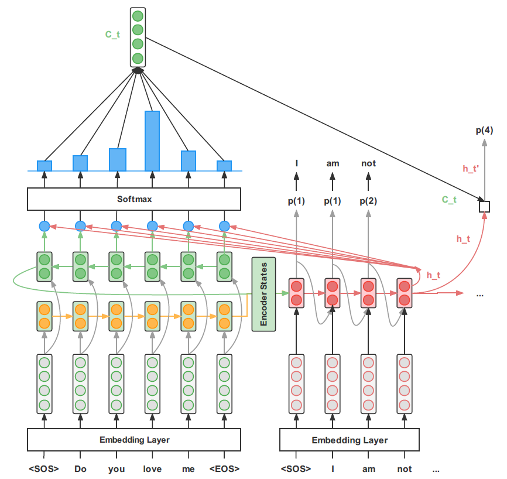
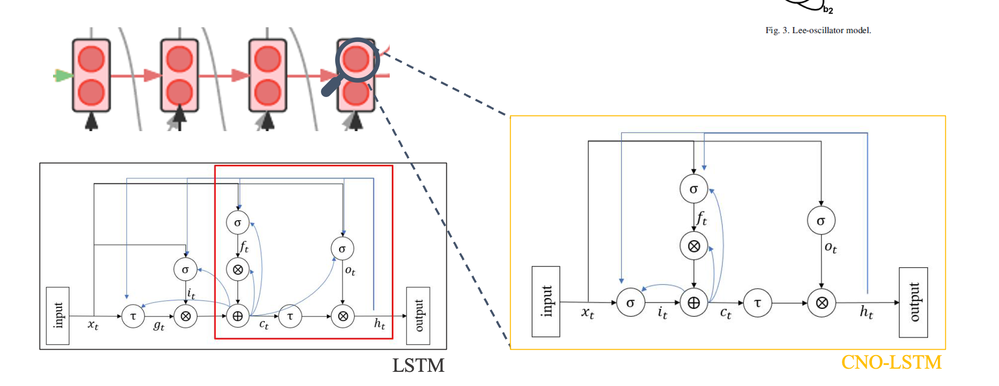
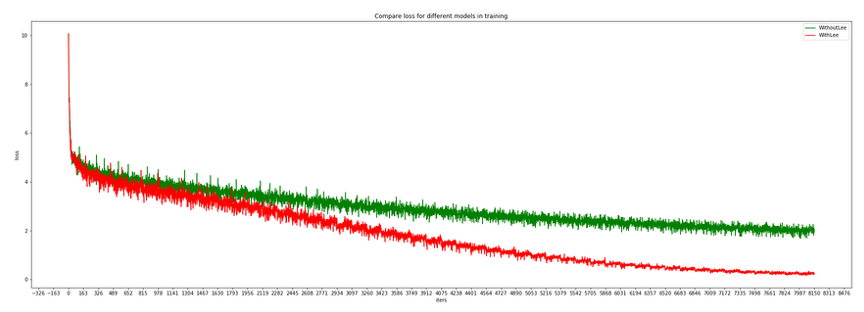
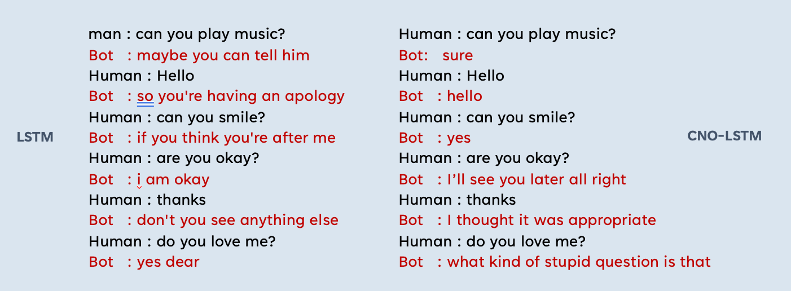

# Language Chatbot 3.0

A Luong‑Attention Seq2Seq chatbot with a Chaotic Neural‑Oscillatory LSTM (CNO‑LSTM / Lee‑Oscillator) for English concept learning.

---

## Application: Thinking Parrot (WeChat mini‑program)

The English learning chatbot is implemented in a WeChat mini‑program named "Thinking Parrot," designed to promote and facilitate English concept learning. The program provides various tools to help and motivate learners, such as collection, daily check‑in, and rank list. The whole learning process is divided into six levels; the first four are implemented (concept introduction, multiple‑choice and oral questions). This FYP focuses on implementing the last level — a chatbot that places learners in more realistic English settings to help them master concept learning through daily chat.

Repository: [Thinking Parrot](https://github.com/liafonx/ThinkingParrot)

---

## Highlights
- CNO‑LSTM (Lee‑Oscillator) integrated into LSTM for chaotic oscillatory dynamics.
- Vectorized, deterministic Lee‑Oscillator activations (GPU‑friendly; no runtime randomness).
- Drop‑in with provided Seq2Seq + Luong attention code (no API friction).
- Reproducible evaluation assets: training/dialog comparisons and full thesis.

---

## Model Overview



- Encoder–Decoder (Seq2Seq): The encoder reads the source sequence; the decoder generates the reply token‑by‑token.
- Luong Attention: Alignment between the decoder state and encoder states produces a context vector fused into the decoder output at each step.
 - CNO‑LSTM (Lee‑Oscillator): Chaotic oscillatory dynamics used as activation/transfer components to enhance training efficiency and memory recall vs vanilla LSTM.

### CNO‑LSTM structure



Compared with a simple imitation of artificial neural networks, chaotic neural networks approximate biologically inspired neuron behaviors and brain‑like dynamics. They act as dynamic neural units for transient information processing and, considering temporal reaction, chaotic neural oscillators naturally fit high‑efficiency or highly frequent tasks.

---

## Results (summary)
- In internal experiments, the CNO‑LSTM converged faster and achieved lower loss than a vanilla LSTM under comparable settings.
- Qualitatively, responses tend to be more coherent and context‑aware compared to the vanilla baseline.

---

## Evaluation

- Training loss comparison and convergence:



- Example dialogue outputs (Chaotic LSTM vs. vanilla LSTM):



- Experiment setup (from thesis): Cornell Movie‑Dialogs, Seq2Seq + Luong attention, matched training regime for LSTM vs. CNO‑LSTM. See thesis for metrics and full details.
- Full paper (HTML): [Language Chatbot 3.0 — 2022](./paper/Language%20Chatbot%203.0_FYP%20Thesis_2022.html)

## Requirements
- Python 3.8+
- PyTorch (CUDA optional)
- numpy, tqdm

Install basics:

```bash
pip install torch numpy tqdm
```

---

## Data
- Dataset: Cornell Movie‑Dialogs Corpus (a copy or sample dialogs are under `data/`).
- Training TSV format: `data/dialog.tsv` (tab‑separated pairs: input<TAB>output).

---

## Quickstart

### Train
```bash
python main.py --train \
  --root="data" \
  --device="cuda" \
  --batch_size=64 \
  --save_dir="chatbot" \
  --teacher_forcing_ratio=0.95 \
  --learning_rate=0.003 \
  --epoch=15 \
  --print_interval=100 \
  --save_interval=1000
```

### Evaluate / Test
```bash
python main.py --test --root="data" --state_dict=<saved state dict>
```

### Inference (Interactive)
```bash
python play.py --state_dict=<saved state dict> --show_confidence
```

> `play.py` provides a simple terminal chat loop (one‑turn at a time).

---

## Project Layout
```
Language-Chatbot-3.0/
├─ data/                          # Dialog data (e.g., dialog.tsv)
├─ chatbot/                       # Saved checkpoints (via --save_dir)
├─ Model/                         # Model modules
│  ├─ LeeOscillator.py            # Current Lee‑Oscillator (vectorized)
│  ├─ ChaoticLSTM.py              # Current Chaotic LSTM
│  ├─ old_LeeOscillator.py        # Legacy Lee‑Oscillator (kept for reference)
│  ├─ old_ChaoticLSTM.py          # Legacy Chaotic LSTM (kept for reference)
│  ├─ VanillaChaoticLSTM.py       # Earlier vanilla chaotic LSTM variant
│  ├─ ChaoticEncoder.py           # Legacy encoder wrapper
│  └─ ChaoticDecoder.py           # Legacy decoder wrapper
├─ main.py                        # Train/Test entrypoint
├─ play.py                        # Interactive inference
└─ README.md
```

Notes
- Checkpoints are saved under `--save_dir` (e.g., `chatbot/`).
- GPU/CPU device is controlled via `--device`.
- Legacy files under `Model/old_*.py` are preserved for reproducibility.

---

## Acknowledgements
- Authors: Yinong Xu, Zhehan Qi
- Supervisor: Dr. Raymond S. T. Lee
- Thanks to the PyTorch community and the maintainers of the Cornell Movie‑Dialogs Corpus.

---

## References (selected)
- Sutskever, Vinyals, Le (2014). Sequence to Sequence Learning with Neural Networks.
- Bahdanau, Cho, Bengio (2014). Neural Machine Translation by Jointly Learning to Align and Translate.
- Luong, Pham, Manning (2015). Effective Approaches to Attention‑based NMT.
- Lee‑Oscillator materials from the authors’ thesis/poster.

